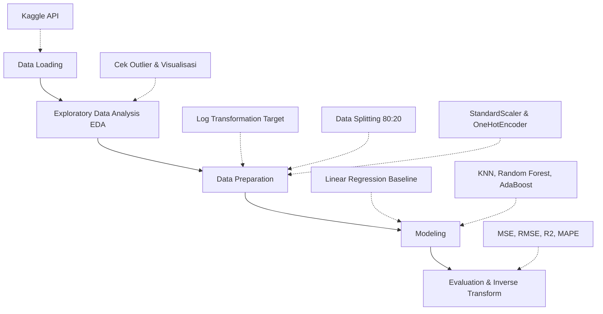

  
# 🍯 Prediksi Kemurnian dan Harga Madu Menggunakan Machine Learning

*Membangun model regresi yang cerdas untuk memprediksi harga madu dengan akurasi tinggi dan stabilitas harga berkelanjutan.*

---

## 📖 Daftar Isi
- [Domain Proyek](#-domain-proyek)
- [Business Understanding](#-business-understanding)
- [Arsitektur Proses](#-arsitektur-proses)
- [Data Understanding](#-data-understanding)
- [Data Preparation](#-data-preparation)
- [Modeling](#-modeling)
- [Evaluation](#-evaluation)
- [Kesimpulan](#-kesimpulan)
- [Referensi](#-referensi)

---

## 🐝 Domain Proyek

### 1. Latar Belakang
Madu merupakan salah satu produk alami yang memiliki banyak manfaat bagi kesehatan. Namun, tidak semua madu yang beredar di pasaran benar-benar murni. Banyak produk madu yang telah dicampur dengan gula, sirup, atau bahan lainnya untuk menekan biaya produksi. Hal ini tentunya merugikan konsumen, terutama jika mereka membeli madu dengan harga mahal tetapi kualitasnya rendah.

Dengan memanfaatkan teknologi *machine learning*, kita dapat membangun model yang mampu memprediksi kemurnian madu dan menaksir harga yang sesuai berdasarkan karakteristik fisik dan kimia yang dapat diukur. Proyek ini bertujuan untuk membantu konsumen dan produsen dalam menentukan kualitas dan harga madu secara objektif.

### 2. Mengapa Masalah Ini Penting?
- 🛡️ **Melindungi konsumen** dari madu palsu.  
- ⚖️ **Membantu produsen** dalam menentukan harga jual yang objektif.  
- 🤝 **Meningkatkan transparansi** dan kepercayaan dalam pasar madu.

---

## 💼 Business Understanding

### ❓ Problem Statements
Bagaimana cara memprediksi **harga madu** berdasarkan karakteristiknya secara akurat?

### 🎯 Goals
1. Membangun model regresi untuk memprediksi harga madu.
2. Menentukan algoritma regresi terbaik untuk prediksi harga madu (dengan komparasi regresi linier dan non-linear).

### 💡 Solution Statements
Untuk mencapai tujuan tersebut, saya menggunakan pendekatan berikut:
- **Baseline Model:** Membuat model dasar menggunakan *Linear Regression* sebagai pembanding awal. Baseline ini bertujuan melihat sejauh mana model sederhana mampu memprediksi harga madu.  
- **Advanced Models:** Menjalankan dan membandingkan beberapa algoritma regresi non-linear seperti *K-Nearest Neighbors (KNN)*, *Random Forest*, dan *AdaBoost*.
- **Evaluation:** Mengevaluasi model menggunakan metrik yang sesuai (RMSE, MSE, R², MAPE) pada ruang *log transform* maupun harga asli untuk memilih model paling stabil.

---

## 🏗️ Arsitektur Proses

Berdasarkan *pipeline* yang dikembangkan pada `[sub1]_emirsyah.ipynb`, berikut adalah arsitektur proses dari awal hingga akhir:

1. **Data Loading:** Mengunduh dataset dari Kaggle secara langsung via `kagglehub`.
2. **EDA:** Mengecek duplikasi, *missing values*, *outliers* dengan IQR, dan melihat distribusi data (*Univariate & Multivariate Analysis*).
3. **Data Preparation:** Melakukan *log transformation* pada harga untuk menangani *skewness*, membagi data latih dan uji (80:20), melakukan *scaling* (StandardScaler) pada fitur numerik, dan *encoding* (OneHotEncoder) pada fitur kategorikal bunga.
4. **Modeling:** Melatih model-model pembanding (KNN, RandomForest, AdaBoost) serta Baseline (Linear Regression).
5. **Evaluation:** Mengukur *error* menggunakan *confidence interval* dan membandingkan performa model setelah dilakukan *inverse log transform* ke skala harga asli (Rupiah/unit harga).

---

## 📊 Data Understanding

**Sumber Data:** Dataset diambil dari [Kaggle](https://www.kaggle.com/stealthtechnologies/predict-purity-and-price-of-honey) dengan **247.903 baris data** dan **11 kolom**.

### 🔍 Fitur-fitur:
| Fitur | Deskripsi | Tipe / Satuan |
|-------|-----------|---------------|
| `CS` | Skor warna madu (rentang 1–10) | Numerik |
| `Density` | Tingkat kepadatan madu | g/cm³ |
| `WC` | Persentase kadar air | % |
| `pH` | Tingkat keasaman madu | Numerik |
| `EC` | Konduktivitas listrik madu | mS/cm |
| `F` | Persentase kandungan fruktosa | % |
| `G` | Persentase kandungan glukosa | % |
| `Pollen_analysis` | Jenis bunga asal madu | Kategorikal (*Clover, Wildflower, dll*) |
| `viscosity` | Tingkat kekentalan madu | cP (centipoise) |
| `purity` | Tingkat kemurnian (0.61 - 1.00) | Numerik / Target Klasifikasi |
| **`Price`** | **Harga madu** | **Target Regresi** |

### 🔬 Eksplorasi Data (EDA)
- ✅ Tidak ada *missing values*.
- ✅ Tidak ada *outlier* signifikan berdasarkan metode IQR.
- Fitur target `Price` memiliki skewness ke kanan (*right-skewed*), sehingga membutuhkan *log transformation*.
- Korelasi antar fitur secara umum lemah.

---

## ⚙️ Data Preparation

- **Transformasi Harga (Log Transformation):** Mengubah target `Price` menjadi distribusi mendekati normal menggunakan `log1p`.
- **Splitting Data (80:20):** Membagi dataset untuk `X_train`, `X_test`, `y_train`, `y_test`. *Price* dihapus agar tidak terjadi *data leakage*.
- **Scaling:** Fitur numerik disamakan skalanya menggunakan `StandardScaler`.
- **Encoding:** Fitur kategorikal `Pollen_analysis` (tipe bunga) dikonversi menggunakan `OneHotEncoder` karena bersifat nominal/non-sekuensial.

---

## 🛠️ Modeling

Tiga algoritma *Advanced* ditambah satu algoritma *Baseline* digunakan:
1. **KNN Regressor:** Memanfaatkan kedekatan 7 tetangga terdekat. Model ini mampu menangkap pola non-linear tanpa banyak asumsi awal.
2. **Random Forest Regressor:** *Ensemble* 300 pohon keputusan (kedalaman maksimal 10). Tahan terhadap *overfitting* dan baik untuk dataset yang lebih kompleks.
3. **AdaBoost Regressor:** Memanfaatkan 250 *base estimator* berbasis pohon yang berfokus memperbaiki kesalahan literasi sebelumnya (*learning rate* 0.08).
4. **Linear Regression (Baseline):** Algoritma linear standar untuk melihat performa prediksi dalam ekosistem linear yang sangat sederhana.

---

## 📈 Evaluation

Berikut adalah perbandingan performa pada *skala logaritma* (log_price):

| Model | RMSE Train | RMSE Test | R² Train | R² Test |
|-------|------------|-----------|----------|---------|
| **AdaBoost** | 0.0093 | 0.0092 | 0.9997 | 0.9997 |
| **KNN** | 0.0205 | 0.0240 | 0.9983 | 0.9976 |
| **RandomForest** | 0.0437 | 0.0438 | 0.9922 | 0.9921 |

Walaupun ketiga model terlihat menjanjikan di skala log, kita harus melihat *real-world impact* dengan merekonstruksi (`inverse_log`) data ke satuan **Harga Asli**.

### 📉 Evaluasi Skala Harga Asli & Linear Regression (MAPE & RMSE)

| Model | MAPE (%) | RMSE (Harga Asli) |
|-------|----------|-------------------|
| **LinearReg (Baseline)**| **0.93 %** | **6.69** |
| KNN | 3.62 % | 35.00 |
| RandomForest | 11.18 % | 74.75 |
| Boosting | 12.31 % | 103.18 |

Meskipun model non-linear sangat akurat pada *log scale*, sedikit selisih (*error*) di ekosistem algoritma logaritmik dapat menjadi ledakan *error* bernilai ekstrem di dunia nyata. **Linear Regression** menghasilkan tingkat deviasi dan *MAPE* paling sempit dan stabil, contoh prediksi: Harga asli `615.18` diprediksi menjadi `618.96`.

---

## 🏆 Kesimpulan

1. Berdasarkan skala *log price*, model *non-linear* seperti **AdaBoost** tampak sangat tangguh dengan skor R² superior.
2. Namun, setelah dilakukan manipulasi balik ke **Skala Harga Asli**, metode *non-linear* memiliki magnitudo *error* yang masif. Hal ini menandakan interaksi sebenarnya antar komponen di dataset `Predict Purity and Price` memiliki hubungan linear dasar yang kuat.
3. Oleh karena itu, **Linear Regression** diusulkan sebagai **Model Utama yang Diterapkan**. Algoritma ini memiliki efisiensi komputasi tinggi, minim kesalahan prediksi aktual, stabil, dan jauh dari jebakan interpretasi *log-scale error*.

---

## 📚 Referensi

1. Kaggle Dataset - *Predict Purity and Price of Honey* oleh Stealth Technologies:  
   [Link Kaggle](https://www.kaggle.com/stealthtechnologies/predict-purity-and-price-of-honey)
2. Scikit-learn Documentation:  
   [https://scikit-learn.org/stable/](https://scikit-learn.org/stable/)

---

  <b>🌟 Jika Anda merasa proyek ini bermanfaat, jangan lupa tinggalkan ⭐ di repository ya!</b>
   
  Dibuat dengan 💻 oleh <b>Emirsyah Rafsanjani</b> | © 2026 

